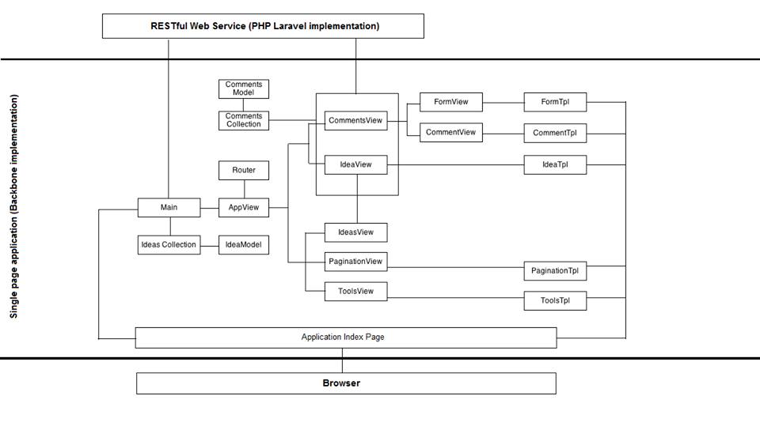
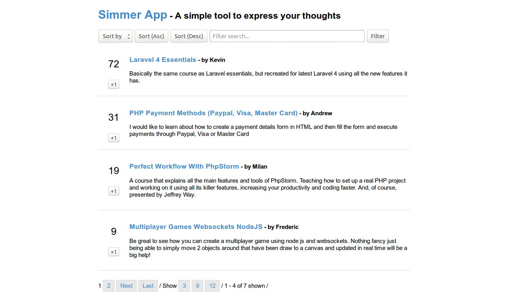

##About Simmer App
Simmer app is a simple SPA project built in Backbone.js and Laravel. The idea behind the app is to see how those two technologies sync up together.   

## App Schema

Let's see quickly how the application is structured. The central part (public folder) is implemented in Backbone (application logic, router, models, collections and views). Laravel is here to provide the app with some data via RESTful architecture.

 

##Screenshot
 

##More info

Hopefully soon! :)